# Entra-ID-Identity-Lab

## Summary
This is a lab created in order to gain hands-on practice & exposure within Entra ID. After the completion of my first Joiner-Mover-Leaver lab [Active-Directory-Identity-Lab](https://github.com/JustaNotion/Active-Directory-Identity-Lab) which was created to demonstrate knowledge of an on-premises environment, I wanted to ensure
that I gain some experience in an environment which is meant to simulate a cloud scenario. This project therefore demonstrates understanding in the Joiner-Mover-Leaver process inside of Entra ID by creating
a basic structure of a real company while also practicing correct privilege assignment & removal upon department assignment, transfer and eventual termination. This was performed on a personal tenant on the 
free tier, not production.

## Stack
As mentioned above this lab was created on Microsoft Entra ID free tier, no Azure subscription of any kind. Additionally this was created as a personal tenant, browser-only. 
P2 features (PIM, Access Reviews, Access Packages) are out of scope for this lab given that they are only available to those who possess a required license. 

## Environment
The environment was set up inside of the "notioneverythinggmail.onmicrosoft.com" domain using the Entra ID free tier. The object count(s) consist of: 8 users, 5 groups and 0 applications. 
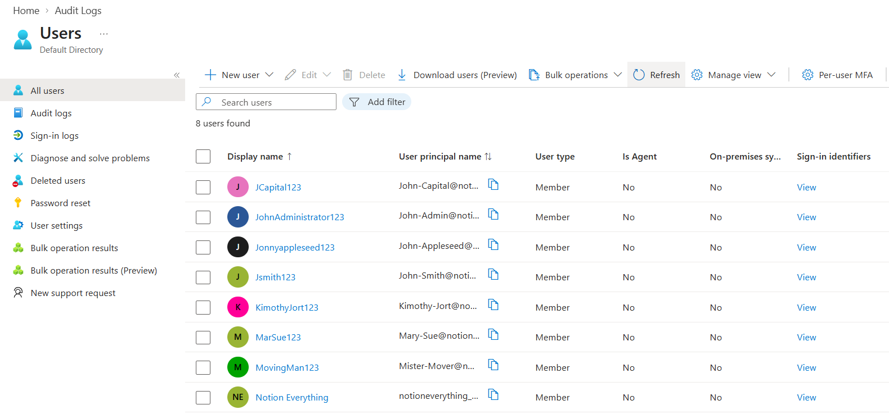
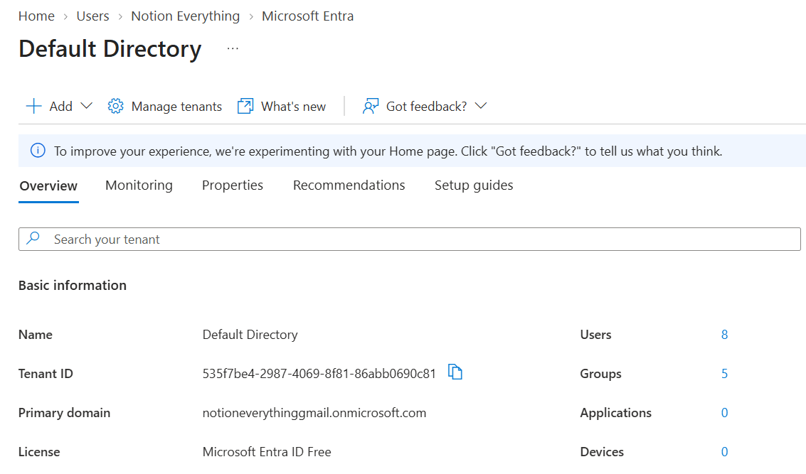

Group inventory includes: IT Admin, Sales, Human Resources, DisabledUsers and Professional Accountants
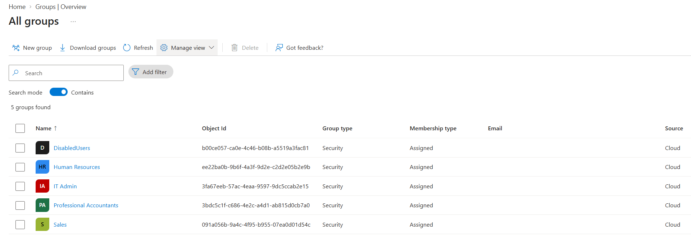

## Identity Lifecycle (Joiner-Mover-Leaver)
For this specific lab a new user was created with the name "Mister Mover". This was the target user meant to demonstrate the Joiner-Mover-Leaver lifecycle process.

Upon creation of the user the first step was to ensure that the password was reset by an admin and prompted the user to create a new password upon their next login. 

The next step was placing Mister Mover into different departments. The key step across the "mover" phase of the lifecycle was removing him from his previous groups as he entered each new department, rather than simply adding the new membership on top. Removing non-applicable groups on transfer keeps his memberships reflecting current standing rather than accumulating every department he's ever passed through. 
 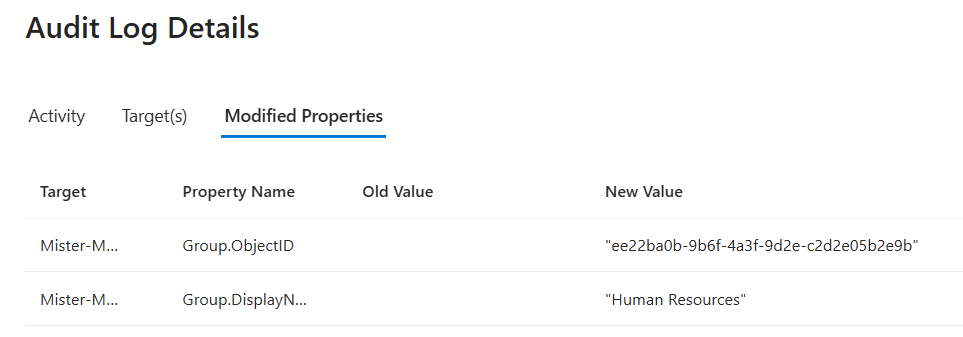 
 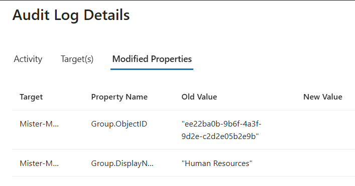

And finally to close out the Joiner-Mover-Leaver lifecycle Mister Mover was stripped of any/all groups which he was placed inside of and subsequently had his account disabled. I purposely elected to disable his account and place him inside of the "DisabledUsers" group rather than deleting. The reason I did this is to ensure that his information and audit logs are still accessible even if he is no longer permitted access to running operations. 

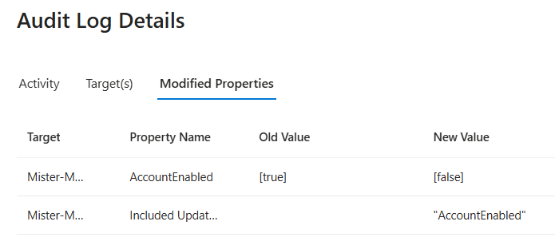
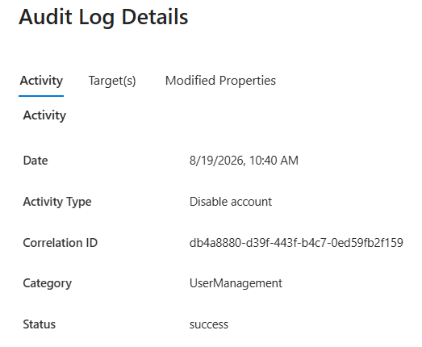 
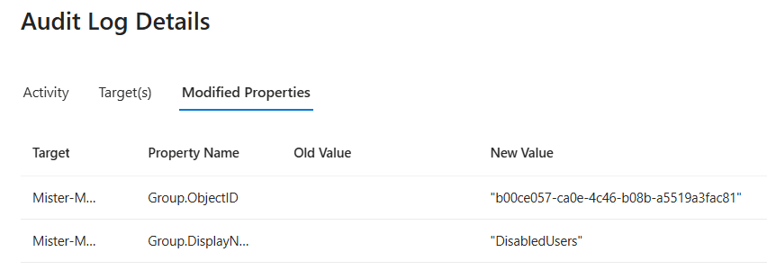

Upon Mister Mover's account disabling and placement within the DisabledUsers group, the Joiner-Mover-Leaver lifecycle had now been successfully demonstrated and completed. 

## Privileged Role Assignment 
In addition to demonstrating the JML lifecycle with the Mister Mover user created for the exercise, I also wanted to create a user specifically meant for the assignment of the "User Administrator" role. This was done by creating a new user with the name "JohnAdministrator123" who was subsequently given the role soon after entry into the system. The assignment path = Direct and the scope was set to directory-wide. The built-in User Administrator role has a variety of different privileges including (but not limited to): creation & deletion of users, resetting passwords, managing group memberships and a variety of other administrative abilities. 

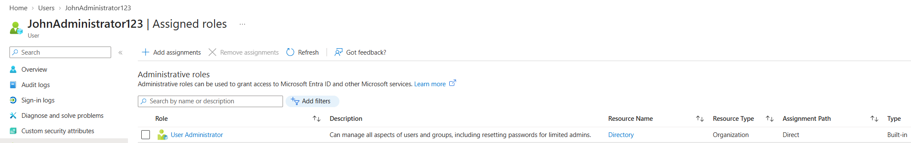
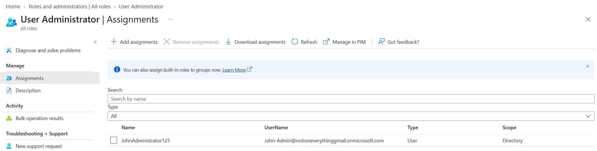

The reason for this is to compare the differences between the group membership that different users were placed in versus the assignment of a specific, privileged role to one user. During the JML lifecycle demonstration, Mister Mover was added, removed and transferred to different locations within the simulated business. However, at no point during that lifecycle was he granted additional permissions/roles. The groups were a hollow shell which he was placed inside of.

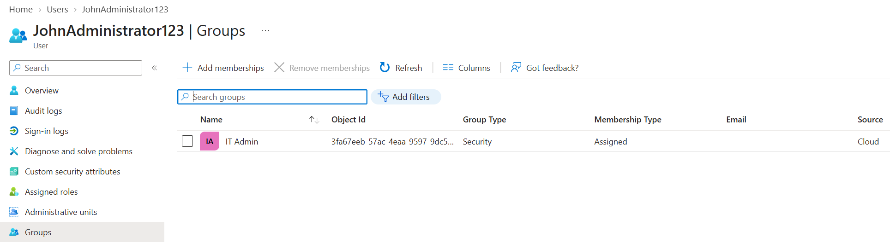

In contrast to the hollow shells, JohnAdministrator123 was given one role and therefore had administrative power which exceeded all of the other example users within this exercise. This standing privilege which JohnAdministrator123 contained is the exact thing which Privileged Identity Management (PIM) exists to address and eliminate. By reviewing, assessing and auditing users on a consistent basis it allows for the discovery (and subsequent addressal) of users who have standing privilege(s) that are non-applicable to their role/department/title.   

## Deletion and Recovery Testing
While the Mister Mover JML lifecycle ultimately concluded with account disabling and removal of any previous assignments to attain zero residual access, I did also want to experiment with purposeful deletion of groups and how membership within groups is affected. 
During the initial environment set up there was a group created entitled "Engineering". Upon the creation of this group a user was subsequently placed inside of this group - "MarSue123". I wanted to verify what would happen in the event that a group was deleted with members currently present within. My primary question was "would I be required to remove the members from the group before full-deletion could be completed?" Therefore I initiated the deletion of the Engineering group and was not prompted with any requirements which needed to be met in order to soft-delete. 

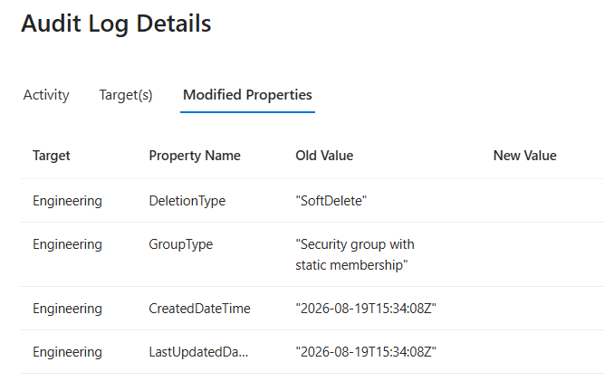

I then quickly initiated (and successfully executed) the hard-deletion of the group. 
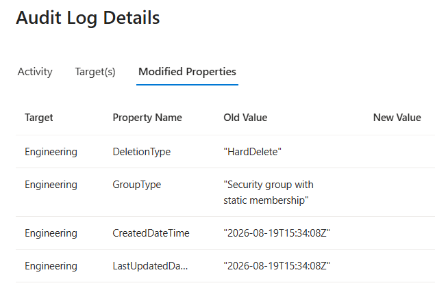

My question was answered; I did not have to remove the member(s) from within the group, the singular member (MarSue123) remained as a functioning user just without the Engineering group placement. I was unsure if this was permanent (what I now recognize as hard-deletion) or perhaps something else. After visiting the audit logs related to the entire lifespan of the Engineering group I was able to confirm that the hard-deletion execution was not automatically performed, I was the one who initiated and ultimately executed the request.
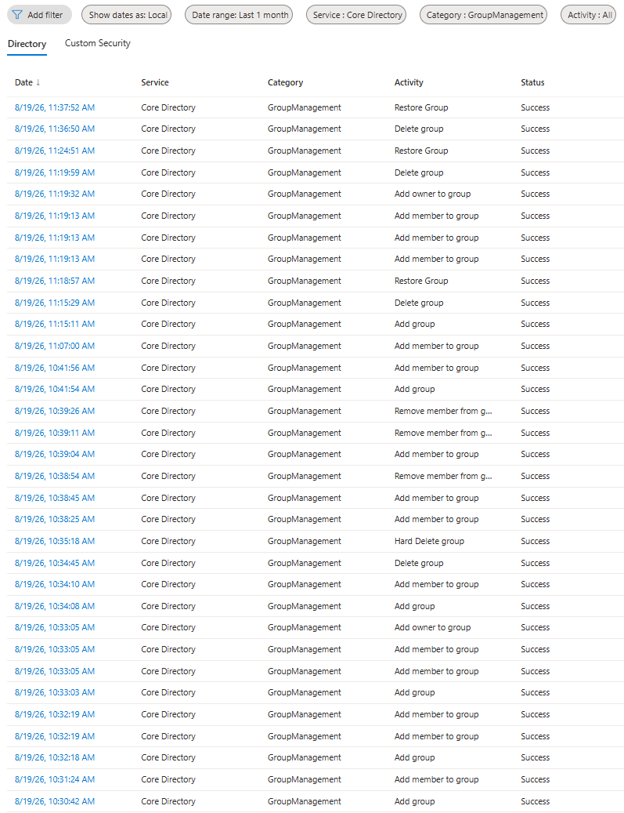

The Engineering creation and subsequent hard-deletion had cleared up any misconceptions that I had about the basic principle of deletion and recovery on Entra ID. After the process was completed I couldn't help but wonder a more specific question in regards to deletion and recovery; "I have already verified that soft-deletion & hard-deletion process are both able to be executed without removal of members present within. But if I were to soft-delete a group with members actively inside, would the members still retain their memberships even during soft-deletion? Additionally upon restoration of a soft-deleted group, would all members retain their placement within the group? Would the group be reset and emptied upon restoration?" And this curiosity is ultimately what led to the second experiment conducted as part of the deletion and recovery testing. 

I created a new, purposeful group entitled "Professional Accountants" with the description of "This group is going to be deleted immediately". I then added 3 members to the group, one of which was the target user for verifying my question - "JonnyAppleseed123". I also added one owner in order to verify if the result would affect one without the other - "MarSue123". One member (JonnyAppleseed123) and the owner (MarSue123), checked before, during and after. After adding all four users to this group I began by screenshotting all of their object IDs to ensure proper matching of the results. Given that any/all deleted Groups (and users) enter a 30 day window before permanent deletion.
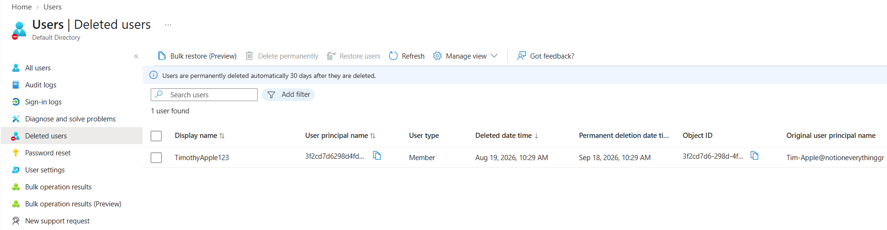

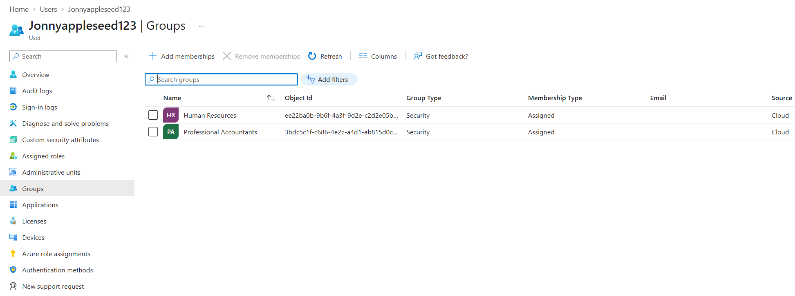
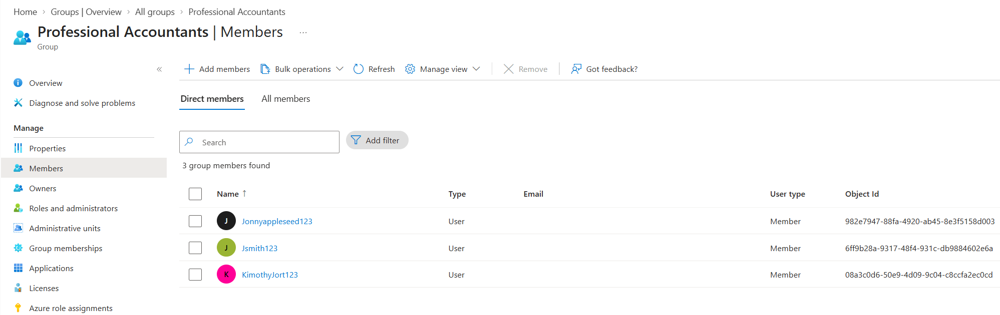

I then initiated the process of soft-deleting the Professional Accountants group, as mentioned above in the first experiment I did not receive any sort of push-back or requirement to begin this process. With the group soft-deleted, I turned my attention to restoration. What the soft-deleted state actually did to the members' access is covered in the next section. After the restoration process completed and Professional Accountants reappeared in the group list I then checked each user of the group and received the answer that I was looking for; upon restoration of a soft-deleted group, all members and owners are placed back inside of the group respective to their original assignment. After verifying that each object ID was a correct match to the screenshots taken before deletion, this experimenting had been completed with the information that I was curious on finding out. 

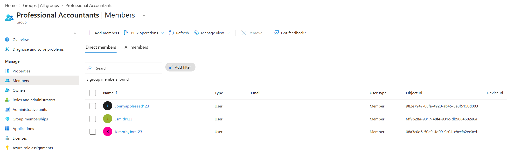

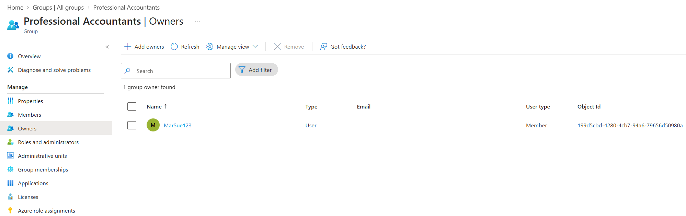

## What Soft-Delete Actually Revokes
As mentioned above during the soft-deletion of the Professional Accountants group, neither the member nor the owner showed any membership in the group. This was verified specifically by assessing the specific user's Groups page (JonnyAppleseed123) in addition to the owner's Groups page (MarSue123). I made sure to go directly to the target user's Groups page. The portal directs you to the group's state, so I checked the user's instead.  

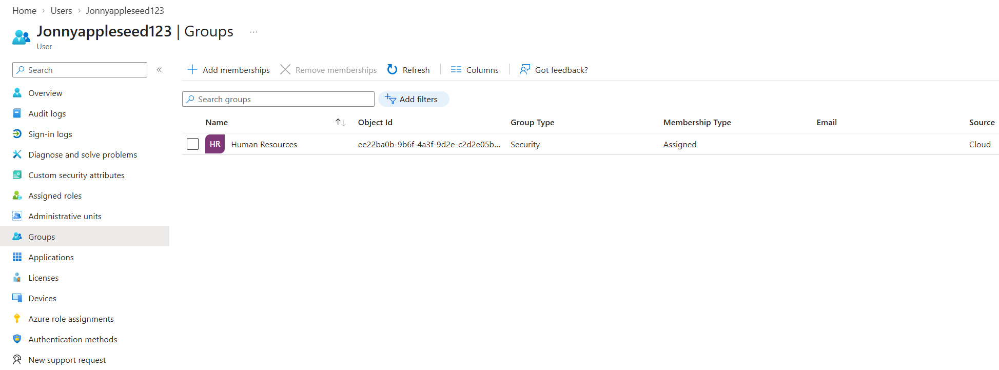
The conclusion: Object recoverability is not continuity of entitlement. Restoring within the 30 day window grants you the object back; however, access was interrupted for the entire window. 

## Audit Evidence
- The "Core Directory" filter was used in order to distinguish actual performed actions versus portal-read related noise. Without this filter the raw auditing log would become extraordinarily tedious to go over, a mix of both performed actions in addition to a variety of different "Self-Service Group Management" logs would appear, drowning out the logs being sought after. 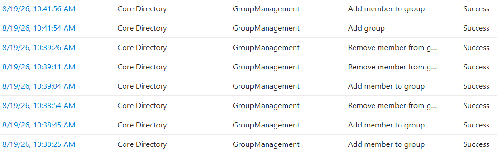
- The PasswordProfile update showing a "service principal" as the actor was surprising to me. After initiating this process I was expecting to locate these logs with the information present alongside a variety of other actions that I executed: "Initiated by (actor) notioneverything_gmail.com#EXT#@notioneverythinggmail.onmicrosoft.com" but this one attributed the change to a service principal instead; it was a reminder that the actor field records what the platform executed the change as, not necessarily who clicked the button. 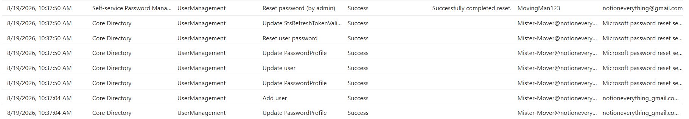
- The AccountEnabled transition from True to False on Mister Mover is captured with both old and new values visible.  
- Add and remove member events likewise record old and new values, evidencing the mover path.
 

- Two full timeline views were captured: the user-management timeline from the start of the lab to its conclusion, and the group-management timeline from the first group created through the experiments. 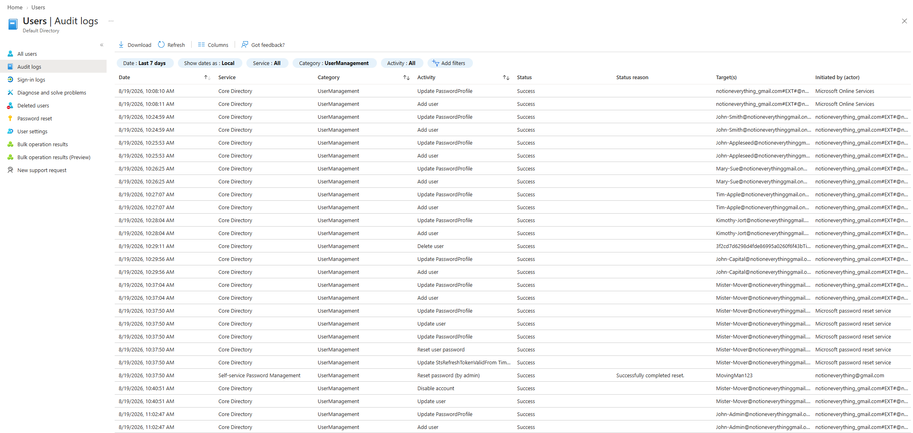 

## Known Limitations
- The biggest known limitation: groups grant nothing. No application, license, or access package consumes them — membership here is a label, not an entitlement.
- DisabledUsers has no policy attached
- Portal language versus platform behavior: the group deletion confirmation and success message make no mention of the 30-day recovery window, presenting deletion as final. The object is in fact recoverable; a gap between what the UI communicates and what the platform does. Both deletion paths were tested on a purpose-made throwaway group:

  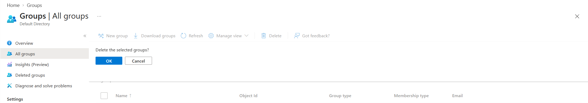
  
  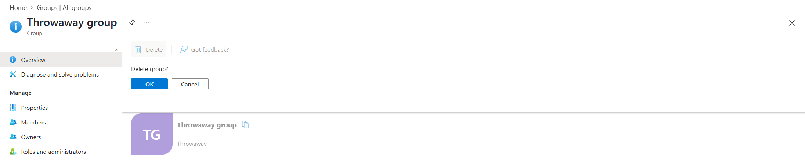
  
  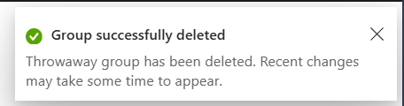
  
- Federation was out of scope for the lifecycle work above; SAML SSO was configured later and is documented below. 
- No P2 features (as referenced in the stack)

## SAML Federation — Entra ID as Identity Provider
This is a follow-up project to the Entra ID setup which was meant to gain an understanding and familiarize myself with SAML. With having the Entra ID tenant setup the logical next step is to add some form of federation with an Enterprise Application. This was done by setting up SSO with the website "IAMShowcase.com" serving as the Service Provider (SP) and Entra ID serving as the Identity Provider (IdP). Demonstrating familiarity with setting up a federation in addition to setting up SSO in addition to troubleshooting and testing different realistic scenarios. 

### How SAML works here
Within this relationship the IdP and SP would communicate one another once the correct information was obtained from the SP and also ensuring that the federation metadata was uploaded to the SP. By doing this the IdP would authenticate the user, issue a signed SAML assertion, have the browser POSTed to the SP's ACS URL where the SP would verify the signature against the certificate uploaded from my metadata before creating a session. All of this would take place with the end goal of simulating a logon attempt by a user within the company who is able to sign-in through SSO. 

### Configuration & Setup
Within this setup the two parties apart of this exercise would be Entra ID which would serve as the Identity Provider (IdP) and a website called "IAMShowcase.com" which would serve as the Service Provider (SP). 
This project began by creating an Enterprise Application from scratch, specifically choosing not to use any of the pre-existing templates available. After the creation of the Enterprise App the first step was to setup the federation. This was completed by obtaining the Entity ID and Reply URL from IAMShowcase. Once this was obtained and entered in the only other step was to download the federation metadata and upload it to IAMShowcase. 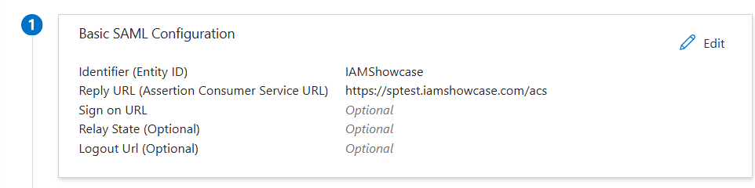 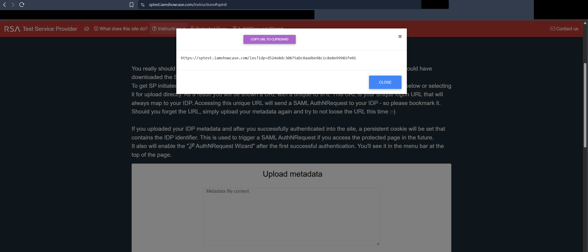 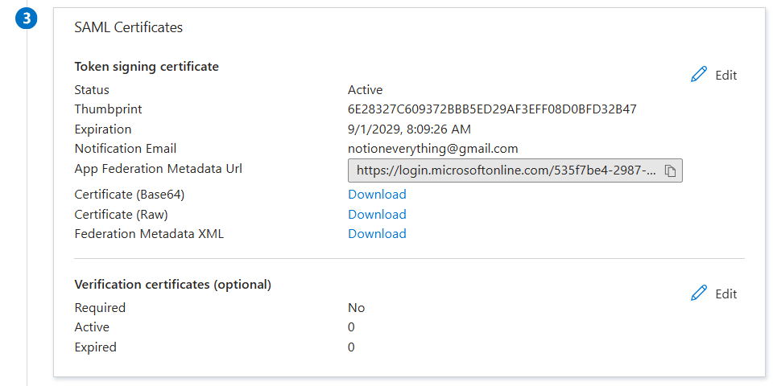

### Logon attempt testing & polishing
After setting up connectivity between the two parties and ensuring that assertion was working successfully the first thing to fix was an error which didn't affect this project but could prove to be an issue in an enterprise setting. Initial (successful) SSO attempts were met with the IAMShowcase website confirming connectivity but also displaying a mangled #EXT# string as the Name ID Claim. 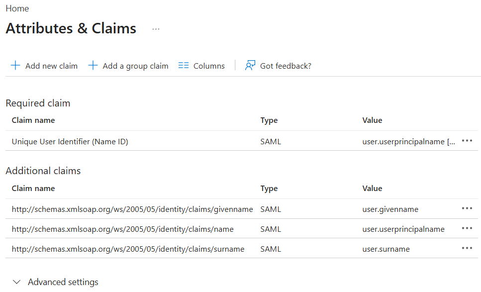 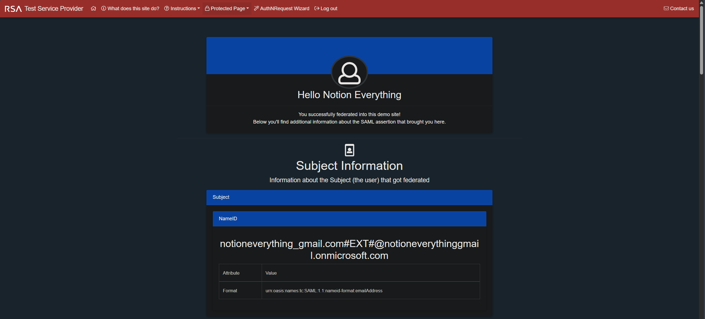 Within the context of this project it proved to be a non-issue since IAMShowcase is meant to be used solely for demonstration purposes. Within a real organization this would prove to be an issue, a SP would receive this request and fail to match it to any existing user in the system, resulting in either an error message preventing connectivity or the creation of an orphan account. Once this was noted the change was to alter the source attribute to "Mail" rather than the default setting of "userprincipalname", upon doing so the Name ID Claim was successfully identified as "Notioneverything@gmail.com". 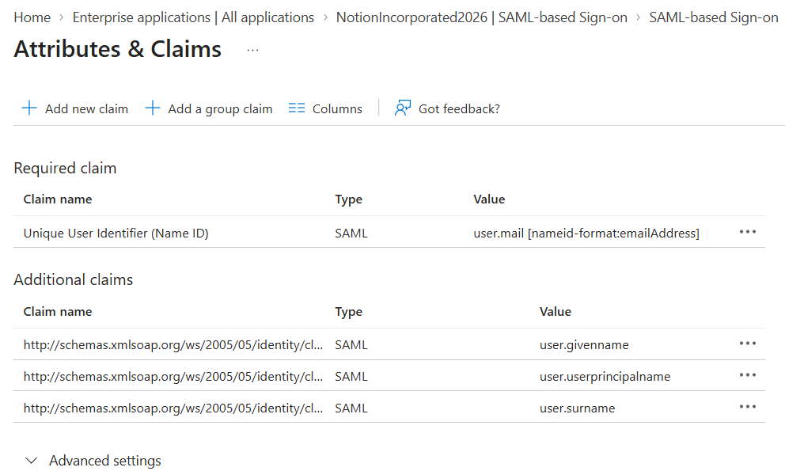 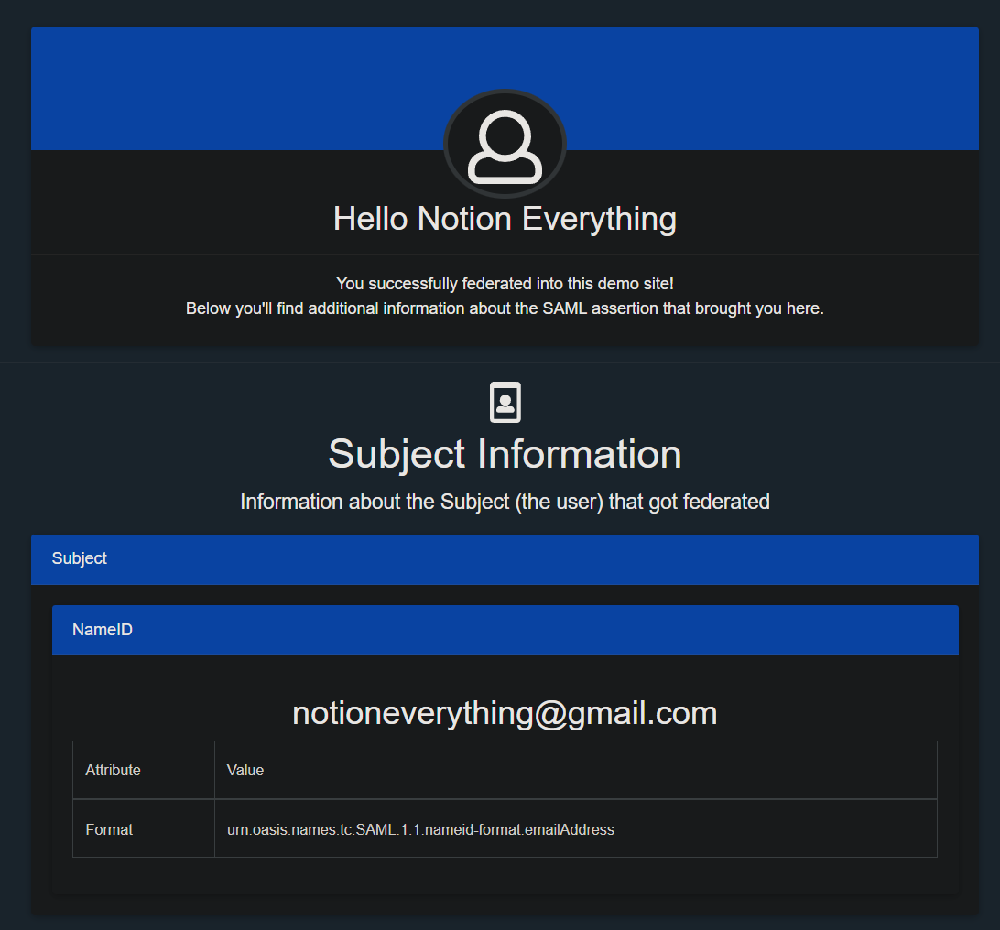

A minor test was conducted after confirming connectivity by replacing the Entity ID and Reply URL with obviously fictitious and incorrect values. Both were replaced with "YouTube" and "Youtube.com" respectively in order to observe the results of pointing towards an unfamiliar SP. Replacing the Reply URL alone returned error code AADSTS50011, a reply-URL mismatch. Notably, when both the Entity ID and the Reply URL were incorrect, the same AADSTS50011 reply-URL error was returned and the Entity ID mismatch was never surfaced — the reply URL is validated first, so a second misconfiguration sat behind it undetected. Both values were reverted to the working IAMShowcase configuration after this brief experiment. 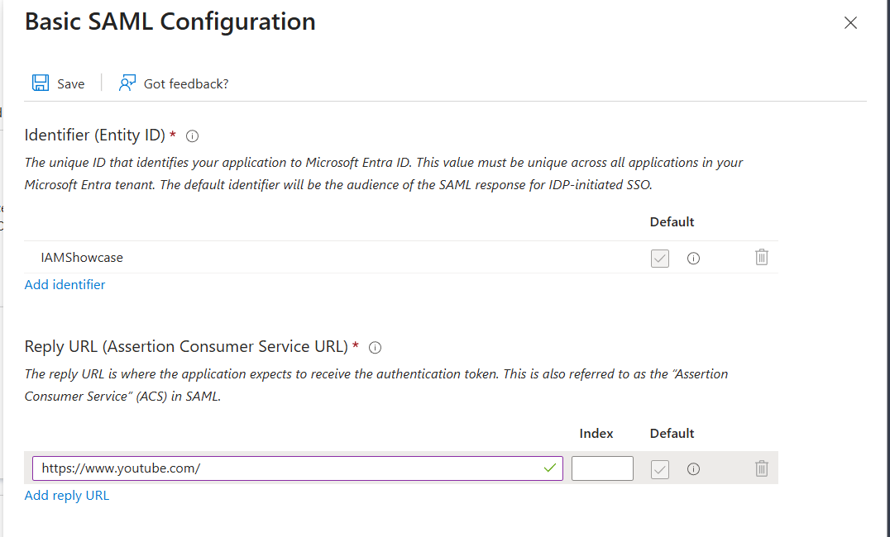  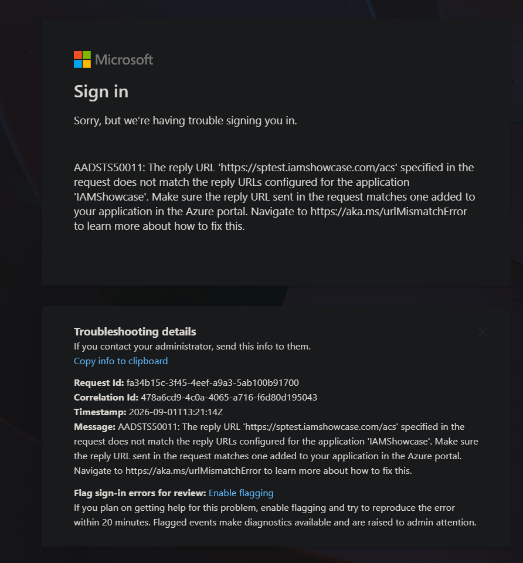.  

And afterwards once both were edited to point towards YouTube the same error code (AADSTS50011) was displayed, proving that both replacements were unsuccessful. 

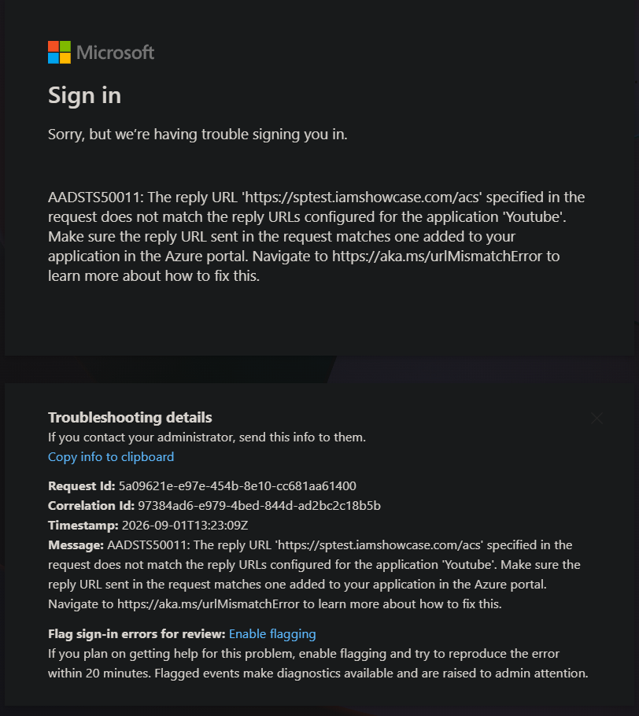.

Both the Entity ID and Reply URL were reverted back to the functioning configuration values from IAMShowcase.com after this brief experiment. 

Another experiment was run by attempting to try to logon with another user who was not involved with the creation of this Enterprise App. I had never assigned Notion Everything as a user to this project, given that the user contains the "Global Administrator" role it allowed for a complete bypass of the restrictions imposed (note: Global Administrator bypassing certain restrictions is a documented Microsoft behavior, not one implemented by me). This was verified by checking the "Only allow assigned users" setting, it was found to be set to "Yes" by default as I hadn't configured this setting. 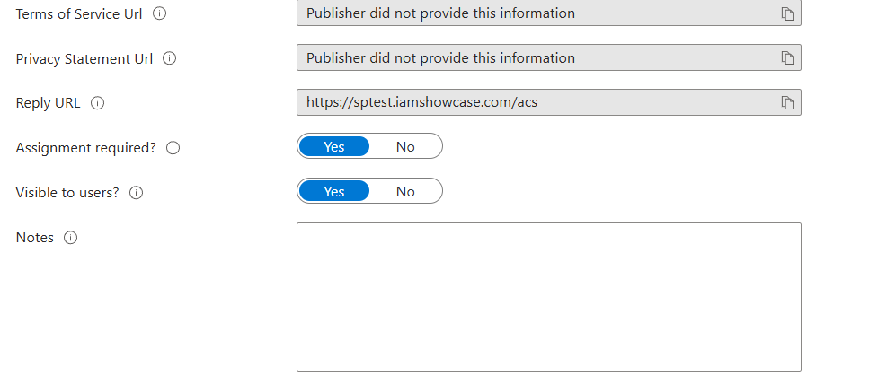A user was used in the testing of this SSO, "John Administrator" would take the role of an employee attempting to login both with and without proper user assignment. It should be noted that John Administrator was assigned the "User Administrator" role during the lab showcased above. This role was purposely left assigned in order to potentially further validate whether a privileged role assignment could bypass an assigned user requirement. 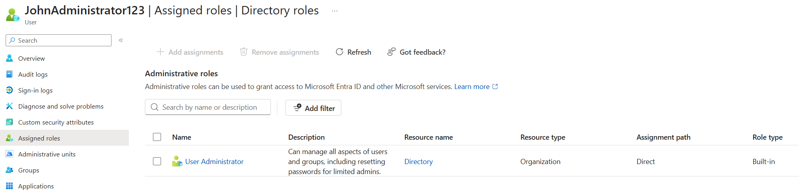 After attempting to send a login request without John Administrator being assigned I was met with an error message which clearly outlines a lack of authority and requirement of user assignment. 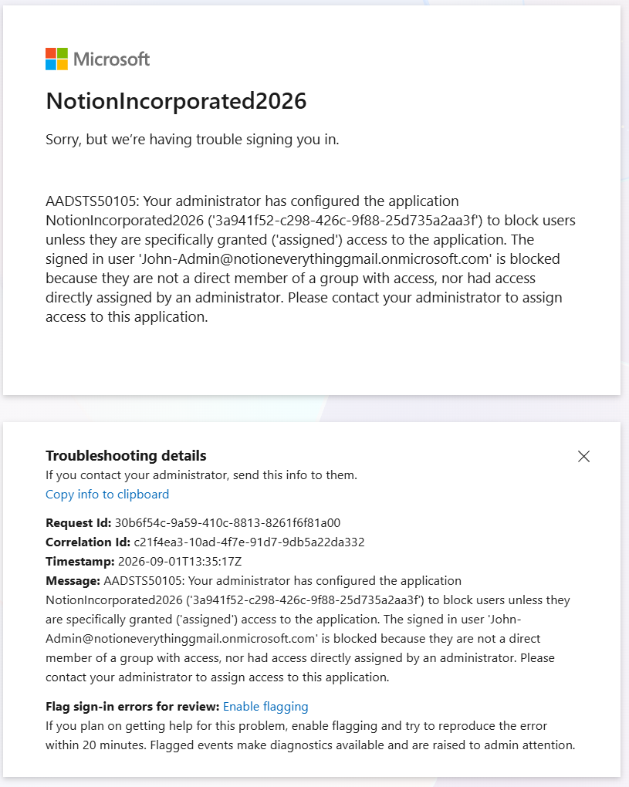 

And after appropriate assignment of the user to this Enterprise App I was successfully able to login to IAMShowcase. 

An interesting observation arose within the Name ID Claim field from earlier, rather instead of a mangled #EXT# string I was instead met with an unfamiliar value despite still retaining the "Mail" configuration. 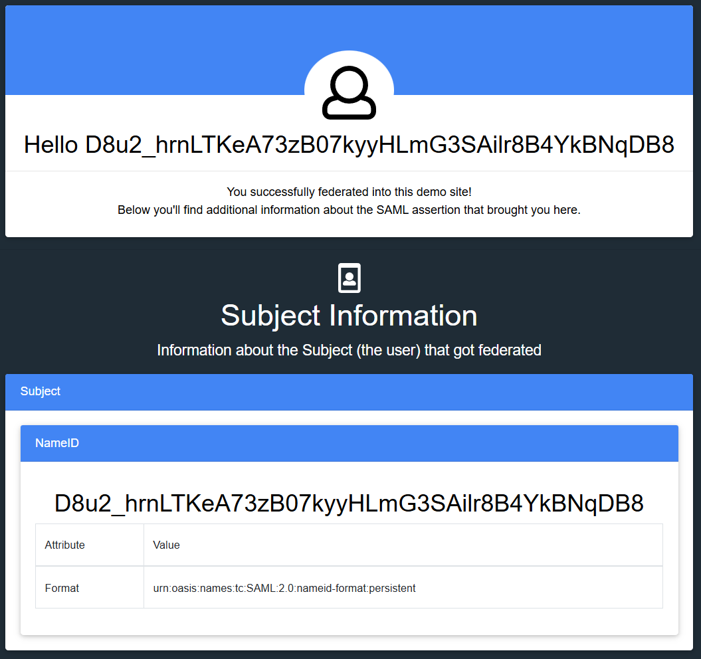 After reviewing contact information for both users (Notion Everything & John Administrator) it was noted that both accounts showed a blank email field. Given that the login attempt mentioned prior clearly demonstrated an email associated with Notion Everything I wanted to cross-check this blank field. This cross-check was completed by use of a tool called "GraphExplorer". By going to [Graph Explorer](https://developer.microsoft.com/en-us/graph/graph-explorer) I was able to send a request for more information on both users, both of which are featured here: 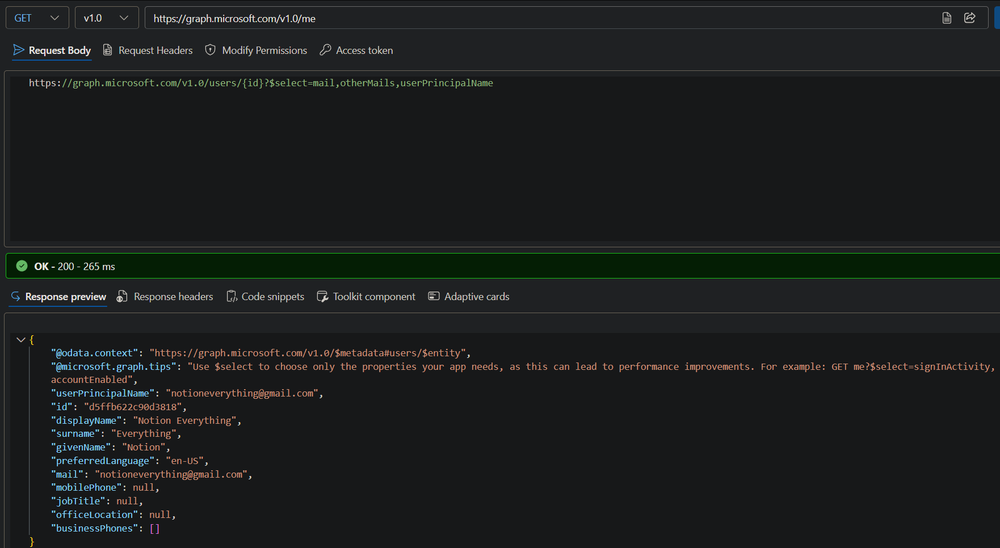 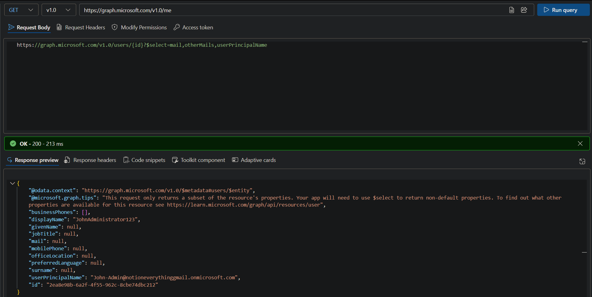 The results showcase the email address associated with the Notion Everything account while simultaneously displaying a "null" value for John Administrator, therefore explaining the Name ID Claim inconsistency between the two users. Worth noting separately: the portal's Contact Information blade showed a blank Email field for both accounts, including the one where the attribute was in fact populated. The blade did not reflect the underlying directory object, and only the Graph query revealed the actual values. Verifying against the directory rather than the admin UI is the reliable approach when a claim behaves unexpectedly.

### Known Limitations
- The service provider used in this exercise (IAMShowcase.com) does NOT verify any signatures. Therefore no confirmation of signing configuration is available in this demonstration.
- The Free tier of Entra ID used does not allow for group-based assignments and only allows for a 7-day log retention. 
- This is a testing/demonstration service provider, this should not be seen or interpreted as any sort of production scale.
- At some point during the process of this lab the certificate thumbprint was changed, I am unsure what caused this but it should be noted that in a production environment this event would have broken the service provider.

### Audit Evidence 
This is an audit screenshot which showcases the full success/failure timeline. Displaying successful federations for both accounts, the AADSTS50105 assignment denial and the AADSTS50011 reply-URL failures all against the same application. 
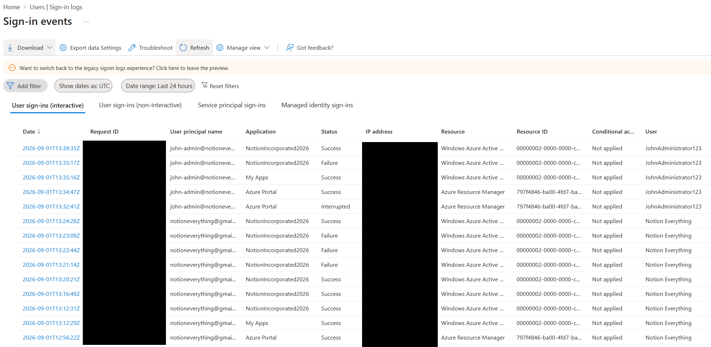
